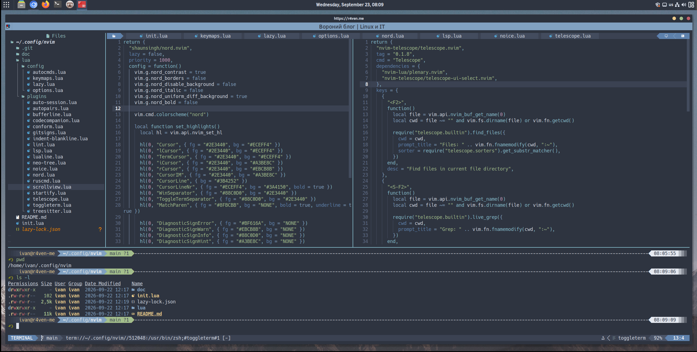

# Neovim Nord Configuration



A modular Lua configuration for Neovim built around `lazy.nvim`, the Nord color palette, Telescope, Treesitter, Neo-tree, ToggleTerm, lightweight linting and formatting, session management, and an AI chat powered by CodeCompanion.

The configuration favors a fast editor with practical IDE features rather than a large preconfigured distribution. Every plugin has its own file under `lua/plugins`, so individual features are easy to inspect, change, or disable.

Created and maintained by **Ivan Cherniy**.

- Website: [r4ven.me](https://r4ven.me)
- Repository: [github.com/r4ven-me/neovim](https://github.com/r4ven-me/neovim)

Inside Neovim, press `Shift+F1` or run `:help nvim-config` to open the built-in help page.

## Requirements

Required:

- Neovim `0.11+`
- Git
- ripgrep (`rg`)
- a terminal with true-color support
- a Nerd Font for icons

Install the basic editor dependencies from the distribution repositories:

```bash
sudo apt install git ripgrep
```

Missing linters and formatters do not prevent Neovim from starting. The configuration enables only executables found in `$PATH`.

## Installing Linters From Distribution Repositories

Prefer packages from the standard Debian/LMDE repositories over `pip install --user`. Distribution packages receive system updates, do not modify Python's user environment, and are immediately available in the normal `$PATH`.

Install all linters supported by this configuration from the standard repositories:

```bash
sudo apt update
sudo apt install shellcheck lua-check pylint yamllint jsonlint zsh
```

Package and executable names are not always identical:

| File type | Debian/LMDE package | Executable used by Neovim |
| --- | --- | --- |
| Lua | `lua-check` | `luacheck` |
| Shell | `shellcheck` | `shellcheck` |
| Python | `pylint` | `pylint` |
| YAML | `yamllint` | `yamllint` |
| JSON | `jsonlint` | `jsonlint` |
| Zsh | `zsh` | `zsh` |

`ruff` is also supported when present, but it is not currently available in the standard LMDE 7 / Debian 13 repository. The configured `pylint` fallback means that installing Ruff through `pip` is optional rather than required.

Formatters available from the same repositories can be installed separately:

```bash
sudo apt install shfmt jq black
```

Tools unavailable in the standard repository, such as `stylua`, `yamlfmt`, or `prettier`, are optional and should be installed only when needed.

## Building Neovim From Source

Some stable Linux distributions still package Neovim 0.10. Build the current release when the packaged version is too old:

```bash
git clone https://github.com/neovim/neovim
cd neovim
make CMAKE_BUILD_TYPE=Release
sudo make install
```

Verify the installed executable:

```bash
nvim --version
command -v nvim
```

## Installation

Back up an existing configuration:

```bash
[[ -d ~/.config/nvim ]] && mv ~/.config/nvim ~/.config/nvim.backup
```

Clone the configuration:

```bash
git clone https://github.com/r4ven-me/neovim ~/.config/nvim
nvim
```

On first startup, `lazy.nvim` installs the configured plugins. Treesitter parsers can be installed non-interactively with the helper from the dotfiles repository:

```bash
~/bin/install-nvim-treesitter-parsers
```

Useful maintenance commands:

```vim
:Lazy
:Lazy update
:TSUpdate
:checkhealth
```

## AI Requirements

CodeCompanion uses Agent Client Protocol adapters for subscription-based Claude Code and Codex access. Install Node.js 22 and both adapters:

```bash
npm install -g node@22
npm install -g \
  @agentclientprotocol/claude-agent-acp \
  @agentclientprotocol/codex-acp
```

Codex is configured to authenticate through ChatGPT. Claude Code can be used through the already authenticated CLI, or through ACP after running:

```bash
claude setup-token
```

Export the generated token as `CLAUDE_CODE_OAUTH_TOKEN` when using the Claude ACP adapter.

## Layout

```text
~/.config/nvim
├── init.lua
├── README.md
├── lazy-lock.json
├── doc
│   ├── nvim-config.txt
│   └── tags
└── lua
    ├── config
    │   ├── autocmds.lua
    │   ├── keymaps.lua
    │   ├── lazy.lua
    │   └── options.lua
    └── plugins
        ├── auto-session.lua
        ├── autopairs.lua
        ├── bufferline.lua
        ├── codecompanion.lua
        ├── conform.lua
        ├── gitsigns.lua
        ├── indent-blankline.lua
        ├── lint.lua
        ├── lsp.lua
        ├── lualine.lua
        ├── neo-tree.lua
        ├── nord.lua
        ├── ruscmd.lua
        ├── scrollview.lua
        ├── startify.lua
        ├── telescope.lua
        ├── toggleterm.lua
        └── treesitter.lua
```

`init.lua` loads options, keymaps, autocommands, and finally the lazy.nvim plugin specifications. Each file in `lua/plugins` returns a regular lazy.nvim specification.

## Main Keybindings

The leader key is `Space`.

| Key | Action |
| --- | --- |
| `Shift+F1` | Open this configuration's Neovim help page |
| `F13` | Git add, commit with `Upd`, and push the current file directory |
| `F2` | Find files in the current file directory |
| `Shift+F2` | Search file contents in the current file directory |
| `F3` | Toggle Neo-tree |
| `F4` | Toggle the bottom terminal |
| `F5` | Toggle the CodeCompanion AI chat |
| `Shift+F5` | Save and run the current shell or Python file |
| `F6` | Show workspace diagnostics in Telescope |
| `Shift+F6` | Show current-buffer diagnostics in Telescope |
| `F7` | Enable linting and run it immediately |
| `Shift+F7` / `F19` | Disable linting and clear diagnostics |
| `F8` | Show Git status in Telescope |
| `Shift+F8` | Show Git history for the current file |
| `F9`–`F12` | Load numbered sessions 1–4 |
| `Shift+F9`–`Shift+F12` | Save numbered sessions 1–4 |
| `Shift+h` / `Shift+l` | Previous / next buffer |
| `Shift+MouseWheel` | Move the current buffer left / right |
| `Ctrl+Up` / `Ctrl+Down` | Resize the bottom terminal |
| `Space f` | Format the current buffer or visual selection |
| `Space d` | Show diagnostics for the current line |
| `[d` / `]d` | Previous / next diagnostic |
| `Space ai` | Toggle the CodeCompanion chat |
| `Space aa` | Open CodeCompanion actions |
| `WW` | Save the current file |
| `WS` | Save the current AutoSession session |
| `WR` | Restore the latest AutoSession session |
| `jk` | Leave insert mode |
| `Esc Esc` | Dismiss messages or search highlighting |

Function-key mappings are forwarded from ToggleTerm to the last editor window, so they remain useful while the terminal has focus.

## UI

- `shaunsingh/nord.nvim` supplies the color scheme.
- `lualine.nvim` provides one global status line.
- `bufferline.nvim` displays buffers and clickable Neo-tree, AI, and terminal controls.
- `neo-tree.nvim` provides the file explorer.
- `nvim-scrollview` provides a scrollbar for the active editor window.
- `indent-blankline.nvim` displays indentation guides.

The AI and terminal buttons in Bufferline are separated by ``. The computer icon opens CodeCompanion and the terminal icon opens ToggleTerm.

## Telescope

Telescope searches relative to the directory of the current file rather than always searching the entire repository:

- `F2`: file names
- `Shift+F2`: file contents
- `F6`: all diagnostics
- `Shift+F6`: current-buffer diagnostics
- `F8`: changed Git files
- `Shift+F8`: current-file Git history

Use `Ctrl+U` and `Ctrl+D` to scroll the preview pane.

## Terminal

ToggleTerm opens terminal number 1 as a full-width horizontal split. It starts in terminal insert mode, can be resized with `Ctrl+Up` and `Ctrl+Down`, and preserves access to editor function keys.

The terminal, Neo-tree, and CodeCompanion windows close automatically when the last normal file window is closed.

## AI Chat

Open CodeCompanion with `F5`, `Space ai`, the computer button in Bufferline, or:

```vim
:CodeCompanionChat Toggle
```

The chat opens on the right and starts in insert mode. Press `F5` again to hide it. Common chat controls:

- `Ctrl+S` in insert mode or `Enter` in normal mode: send a message
- `ga`: switch adapter between Codex, Claude Code, and other available adapters
- `Ctrl+C`: close the chat
- `q`: stop the current request
- `?`: show chat-local keybindings

Editor context can be referenced in prompts:

- `#{buffer}`: current buffer
- `#{buffers}`: all open file buffers
- `#{selection}`: visual selection
- `#{diagnostics}`: current diagnostics
- `#{diff}`: Git diff
- `#{terminal}`: recent terminal output
- `#{viewport}`: visible editor content

`render-markdown.nvim` formats model responses, headings, lists, tables, and code blocks. Rules such as `~/.claude/CLAUDE.md` are still sent to the agent, while their repetitive `Context` block is hidden from the chat UI.

Direct CLI sessions are also available:

```vim
:CodeCompanionCLI agent=claude_code
:CodeCompanionCLI agent=codex
```

## Linting And Formatting

`nvim-lint` provides diagnostics without requiring LSP. Automatic linting starts disabled. Pressing `F7` enables it for the current Neovim session, runs a check immediately, and then refreshes diagnostics 500 ms after entering a buffer, saving, leaving insert mode, or changing text. The debounce prevents a new external process from starting on every keystroke.

`Shift+F7` or `F19` disables linting again and clears diagnostics. Automatic linting can also be toggled with `:LinterToggle` or `:LintToggle`. Debounce timers are maintained per buffer, so switching files quickly cannot apply a delayed check to the wrong file.

`conform.nvim` formats on demand with `Space f`. There is no format-on-save hook.

Configured tools include:

- Lua: `luacheck`, `stylua`
- Shell: `shellcheck`, `shfmt`
- Python: `ruff`, `pylint`, `ruff_format`, `black`
- JSON: `jsonlint`, `jq`
- YAML: `yamllint`, `yamlfmt`, `prettier`

## Sessions And State

Persistent files are stored below `~/.local/state/nvim`:

- swap: `swap/`
- undo history: `undo/`
- backups: `backup/`
- sessions: `sessions/`
- ShaDa: `shada/main.shada`

AutoSession does not restore automatically on startup. Use `WS` and `WR`. Neo-tree is temporarily removed while a session is saved and restored afterward without stealing focus.

Four explicit session slots are available with `F9`–`F12` and their Shift variants.

## LSP

`lua/plugins/lsp.lua` contains a disabled starter configuration. To enable it:

1. install the required language servers;
2. change `enabled = false` to `enabled = true`;
3. configure the desired servers in the plugin file.

The lightweight lint and format setup works independently of LSP.

## Troubleshooting

Check the complete configuration without opening the UI:

```bash
nvim --headless '+lua print("config ok")' '+qa'
```

Useful diagnostics:

```vim
:checkhealth
:checkhealth codecompanion
:messages
:Lazy log
```

If icons are missing, install and select a Nerd Font. If Telescope content search fails, install `ripgrep`. If CodeCompanion is disabled, verify that Neovim is version 0.11 or newer and that the ACP executables are available in `$PATH`.

## License

GNU General Public License v3.0 or later (GPL-3.0-or-later), see
[LICENSE](LICENSE).
